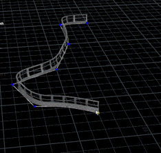
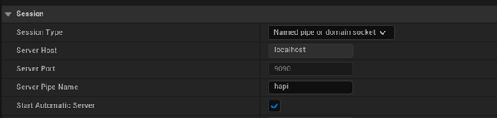

# tinyCity
tinyCity is a collection of procedural modeling tools in .hda format, designed for creating urban environments.

## Overview
This toolkit focuses on generating assets for city-like environments. It also includes reusable utility assets suitable for a variety of other projects.

To demonstrate how these tools work together, the package includes a sample scene asset: Demo City.hda.

## Asset Types
The project includes two categories of tools:

- Generative assets – Create geometry independently, without external input.

- Utility assets – Helpful supporting tools that can be used across other workflows.

Example of Generative: House.hda 

ExampleS of Utility:
- Grid subdiv.hda

- Spline Adapter.hda

## How to use
You can use the assets directly in game engine workflow via [Houdini Engine](https://github.com/sideeffects/HoudiniEngineForUnreal), or in Houdini then export the models as .fbx.

### Integration
To use these tools in a game engine, make sure you're using a compatible version of [Houdini Engine](https://github.com/sideeffects/HoudiniEngineForUnreal).

Steps:
1) Import the .hda asset into the engine with the Houdini plugin enabled.
2) Ensure that both Houdini and the plugin are configured to use the same port or named pipe.
3) If issues arise, verify the connection settings on both ends.

Example configuration from Unreal Engine:

